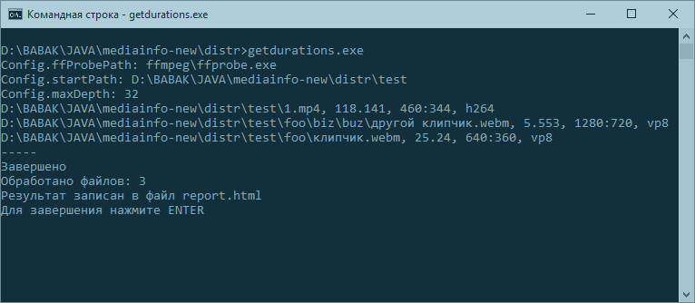
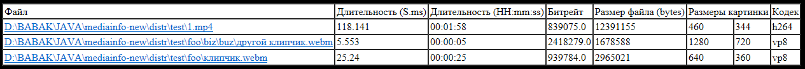

# java-mediainfo
Get video media info by directory path
 
Программа для получения характеристик видео файлов в указанной директории и её дочерних папках:
* Файл
* Длительность (S.ms)
* Длительность (HH:mm:ss)
* Битрейт
* Размер файла (bytes)
* Размеры картинки
* Кодек

Поддерживает сетевые пути, но не поддерживает русские символы в пути к корневой папке ([ошибка Java](https://bugs.java.com/view_bug.do?bug_id=4733494), мы не стали исправлять).

 
Результаты записываются в файл report.html, который можно скопировать в Excel, Powergold и т.д.

[Скачать .EXE-файл для windows](https://github.com/bridgemedia/java-mediainfo/raw/master/java-mediainfo-windows.zip)
